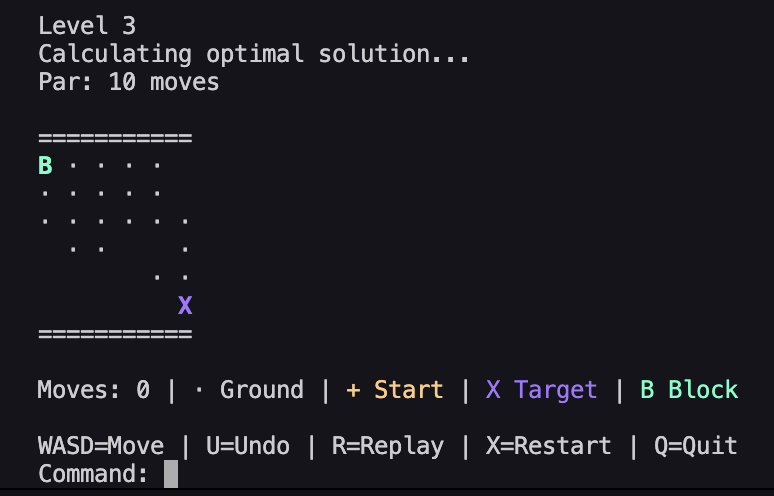
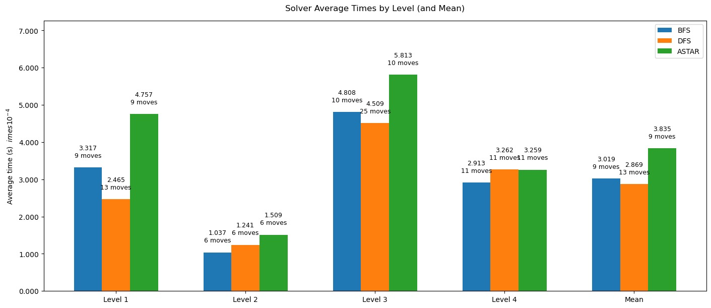

# Bloxorz AI Solver

An automated solver and interactive terminal game for the spatial puzzle **Bloxorz**, built in Python. The project demonstrates the application of uninformed (**BFS**, **DFS**) and informed (**A\***) search algorithms on a grid-based state space.

Developed as the Final Project for **Computation II: Algorithms & Data Structures** at **NOVA Information Management School (NOVA IMS)**.

## Tech Stack

* **Language:** Python
* **Algorithms & Logic:** A* Search, BFS, DFS, Admissible Heuristic Formulation, State-Space Graph Search
* **Data Structures:** Priority Queues (`heapq`), Deques (`collections.deque`), Hashable State Tuples
* **CLI / UI:** Colorama

---

## Key Features
* **Interactive Terminal UI:** Built with `Colorama` for high-contrast visual feedback (Cyan for Block, Green for Target, Soft White for Terrain).
* **Solvers (AI Engine):** Computes optimal paths using **BFS**, **DFS**, and **A\*** search strategies.
* **Admissible Heuristic:** Custom-tailored Manhattan Distance heuristic designed specifically for 3D block rolling mechanics.
* **Bonus Game Features:**
  * **Undo / Replay:** Rollback state history or watch the AI solve the level step-by-step.
  * **Par Score:** Dynamic calculation of the optimal move count prior to level start.

## Game Interface



---

## Algorithmic Analysis & Benchmark (Productivity Paradox)

Below is the benchmark analysis comparing solver execution times ($\times 10^{-4}$ seconds) and path lengths across 4 test levels:



### Key Insights:
* **Guaranteed Optimality:** Both **BFS** and **A\*** consistently find the optimal (shortest) path across all levels.
* **Productivity Paradox:** While **A\*** visits fewer nodes overall, its overhead (managing a `heapq` priority queue and calculating heuristics) results in slightly higher execution time on small graphs compared to raw **BFS** using `collections.deque`.
* **DFS Trade-off:** **DFS** is fast and memory-efficient, but often explores unnecessarily deep branches (e.g., 25 moves on Level 3 vs. 10 optimal moves).

---

## Heuristic Formulation

To ensure **A\*** remains optimal, the heuristic $h(s)$ must be **admissible** (never overestimate the actual cost to the goal).

In Bloxorz, a block rolling flat covers **2 grid cells in a single move**. A standard Manhattan Distance would overestimate the steps required, breaking admissibility. Our heuristic calculates the Manhattan Distance and divides it by $2.0$:

$$h(s) = \frac{|r_{\text{current}} - r_{\text{goal}}| + |c_{\text{current}} - c_{\text{goal}}|}{2.0}$$

---

## System Architecture

* `main.py`: Entry point, level selector, and routing engine.
* `board.py` / `state.py`: Grid matrix, normalization logic, and $O(1)$ hashable state tuple.
* `block.py`: Physical rotation mechanics for Upright, Horizontal, and Vertical states.
* `game.py`: Core controller handling user input, move history, and win/lose checks.
* `basic_solvers.py` / `astar_solver.py`: Search algorithms (BFS, DFS, A\*).

---

## Documentation & Resources

* [Project Report (PDF)](docs/Group_14_report.pdf) — Full mathematical and structural breakdown.
* [Presentation Slides (PDF)](docs/presentation.pdf) — Benchmarks, state space formalization, and performance analysis.
* [Self Evaluation Matrix (XLSX)](docs/Group_14_selfeval.xlsx) — Detailed team workload distribution.

---

## Installation & Usage

**1. Clone the repository:**
```git clone https://github.com/elaygg/bloxorz-computation-ii.git```      |        
```cd bloxorz-computation-ii```

**2. Create and activate virtual environment:**
```python -m venv .venv```
# mac OS / Linux:
```source .venv/bin/activate```
# Windows:
```.venv\Scripts\activate```

**3. Install dependencies:**
```pip install -r requirements.txt```

**4. Run the game:**
```python main.py```

---

## Contributors

**Amir Namatov:** Implemented A* search algorithm (astar_solver.py), modified Manhattan distance heuristic, heapq priority queue integration, written report.

**Leon Apaydin:** Developed core Game Engine (game.py), main execution loop (main.py), Colorama Terminal UI, Undo/Replay and Move Counter bonus features.

**Mohammad Ammaar:** Implemented Board (board.py) and State (state.py) classes, matrix parsing, coordinate tracking, collision/win logic, and level designs.

**Oghenemega Ogugu:** Implemented Block rolling physical mechanics (block.py), BFS and DFS algorithms (basic_solvers.py), and theoretical complexity analysis.


